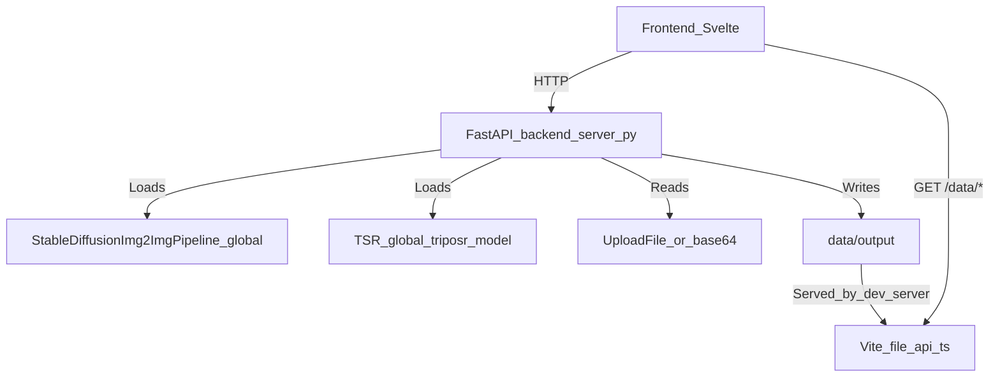

# Backend Architecture (Current State)

This repository’s “backend” is a **single FastAPI process** responsible for:

- **Stable Diffusion 1.5 img2img** inference (Diffusers)
- **TripoSR** single-image → 3D mesh (GLB) inference (embedded `backend/tsr/` implementation)

It is designed primarily for **local/offline** use, but can be evolved into a cloud service.

## Phase_0 refactor status (executed)

The Phase_0 “safe refactor” has been **executed** (not just planned) on the `phase0-backend-refactor` branch. Behavior is intended to be preserved, but internal code is now split into a small package:

- `backend/app/config.py`: env-based backend settings (paths, CORS, debug log path)
- `backend/app/runtime/device.py`: device + dtype selection (preserves MPS float32 rule)
- `backend/app/storage/artifacts.py`: centralized artifact naming/paths
- `backend/app/services/img2img_service.py`: SD img2img orchestration extracted from `server.py`
- `backend/app/services/triposr_service.py`: TripoSR orchestration extracted from `server.py`
- `backend/app/runtime/concurrency.py`: per-model semaphores (default 1 in-flight per model)

## Phase_1 job-based API status (executed on this branch)

Phase_1 has been implemented in a **local-first** way (Option A):

- Adds a **job queue** and **job API** under `/api/jobs/*` so work can be queued and progress streamed via SSE.
- Keeps existing endpoints working; legacy endpoints now **delegate to the job system**.
- Introduces a provider seam (`backend/app/services/providers/*`) to support future **new local models** and **vendor APIs** (e.g. Nano Banana) without rewriting the job engine.

## High-level data flow

Key point: **`backend/server.py` writes artifacts into `data/output/` and returns URLs like `/data/output/...`, but it does not itself serve `/data/*`.** In dev, `/data/*` is served by Vite middleware (`server/file-api.ts`). In production you’ll need a replacement (static server or object storage).

## Runtime entrypoint

- `backend/start.sh` creates/activates a Python `venv`, installs deps from `backend/requirements.txt`, then runs:
  - `python server.py`
- `server.py` also supports `python server.py` directly and runs uvicorn on `0.0.0.0:8000`.

## Environment variables (Phase_0)

The backend now supports these optional settings (defaults keep current behavior):

- `DNA_DATA_DIR`: defaults to `<repo>/data`
- `DNA_OUTPUT_DIR`: defaults to `<repo>/data/output`
- `DNA_CORS_ALLOW_ORIGINS`: either JSON list or comma-separated string
- `DNA_DEBUG_LOG_PATH`: defaults to `<repo>/.cursor/debug.log`

## Devices, precision, and why it matters

`server.py` picks a device via `get_device_and_dtype()`:

- **CUDA** (NVIDIA GPU): uses `torch.float16` and enables attention slicing + tries xFormers.
- **MPS** (Apple Silicon): forces `torch.float32` (stability/NaN avoidance in VAE).
- **CPU**: `torch.float32`.

### Do these models benefit from GPUs?

Yes—significantly.

- **Stable Diffusion** is dominated by repeated UNet denoising passes. A GPU (CUDA or MPS) is typically **multiple times faster** than CPU, and CUDA FP16 is usually fastest.
- **TripoSR** includes neural rendering / triplane queries and can also be **much faster** on GPU. It also supports chunking to reduce peak memory (`chunk_size`).

For your stated target (“MacBook Pro M2–M4 now, cloud GPU later”), MPS is a good local baseline, and a single cloud NVIDIA GPU worker is the typical next step for higher throughput.

## Model lifecycle (current)

### Stable Diffusion (SD 1.5)

On FastAPI startup (`@app.on_event(\"startup\")`), the backend tries to find models under:

- `data/models/sd-v1-5-local/` (preferred, **fully offline**, Diffusers format)
- fallback: `data/models/v1-5-pruned-emaonly-fp16.safetensors` (may require a one-time network fetch for config)

Loading strategies:

- `load_model_local(model_path)` loads a local Diffusers directory with `local_files_only=True`.
- `load_model_from_safetensors(model_path)` loads from a `.safetensors` single file.
  - On success it attempts to `pipeline.save_pretrained()` into `sd-v1-5-local` for future offline runs.

Setup helpers:

- `backend/setup_model.py`: one-time online config download then saves local Diffusers directory.
- `backend/setup_offline.py`: same but disables SSL verification (corporate proxy workarounds).
- `backend/setup_manual.py`, `backend/convert_model.py`, `backend/convert_weights.py`: offline conversion utilities.

### TripoSR (TSR)

TripoSR is lazily loaded on first request (or explicitly via `/api/triposr/load`) from:

- `data/models/triposr-base/`

The model loader:

- Imports `TSR` from `backend/tsr/system.py`
- Calls `TSR.from_pretrained(<local_dir>, config_name=\"config.yaml\", weight_name=\"model.ckpt\")`
- Moves model to device, configures renderer chunk size.

## API endpoints (current)

All endpoints are implemented in `backend/server.py`.

Phase notes:
- Phase_0: handlers delegate to `backend/app/services/*` for SD and TripoSR orchestration.\n+- Phase_1: handlers delegate to an in-process job system; endpoints and response shapes are intended to remain the same.

### Health and model status

- `GET /api/health` → `{ status, model_loaded }`
- `GET /api/model/info` → `{ loaded, model_name, device }`
- `POST /api/model/load` → attempts to load a model from a provided path (see note below)
- `GET /api/triposr/info` → `{ loaded, device, model_name }`
- `POST /api/triposr/load` → loads TripoSR (optionally sets `chunk_size`)

**Note:** `/api/model/load` calls `load_model(model_path)`, but there is no `load_model` function defined in `server.py`. This endpoint is likely unused or is a leftover and would fail if called.

### SD img2img

- `POST /api/img2img` (multipart upload)
  - Reads image file, resizes (caps max dimension to 768, rounds down to multiples of 8)
  - Sets scheduler based on `sampler_name` and `scheduler` mode
  - Calls Diffusers pipeline with `strength=denoise`, `num_inference_steps=steps`, `guidance_scale=cfg`, seed
  - Saves output to `data/output/img2img_<timestamp>_<seed>.png`
  - Returns a Data URL (`data:image/png;base64,...`) plus metadata and `output_path`.

- `POST /api/img2img/base64` (multipart form field)
  - Same as above, but input image is a base64 string / data URL.

- `POST /api/img2img/stream` (SSE)
  - Sends SSE `progress` events using Diffusers callback hooks
  - On completion sends `complete` with final image (base64 data URL).

### TripoSR mesh generation

- `POST /api/triposr` (multipart upload)
  - Optionally removes background (`rembg` + TSR utils), normalizes/crops input
  - Runs `triposr_model([input_image], device=device)` to get `scene_codes`
  - Extracts mesh via marching cubes (skimage) at `mc_resolution`
  - Applies hardcoded orientation correction transforms
  - Optional: bake texture atlas using `backend/tsr/bake_texture.py` (xatlas + moderngl rasterization)
  - Writes `data/output/mesh_<timestamp>_<id>.glb`
  - Optional: renders turntable MP4 via `triposr_model.render()` + `tsr.utils.save_video()`
  - Also attempts a preview PNG via `trimesh.Scene.save_image()`
  - Returns URLs under `/data/output/...` and mesh stats.

### Phase_1 job endpoints (new)

- `POST /api/jobs/img2img` → `{ job_id, status }` (multipart: same params as `/api/img2img`)
- `POST /api/jobs/triposr` → `{ job_id, status }` (multipart: same params as `/api/triposr`)
- `GET /api/jobs/{job_id}` → job status + progress + result/error
- `GET /api/jobs/{job_id}/events` → SSE events (`queued`, `started`, `progress`, `completed`, `failed`, `cancelled`)
- `POST /api/jobs/{job_id}/cancel` → best-effort cancellation (queued jobs cancel immediately; running cancel is best-effort)

## Concurrency + scaling implications (current)

The backend is structured for multi-user concurrency (Phase_0 + Phase_1):

- Uses **global mutable state** (`pipeline`, `triposr_model`, `model_loaded`, `triposr_loaded`, `current_device`).
- Phase_1 runs heavy compute in background workers and uses **in-memory queueing** to avoid tying up the event loop.\n+- Includes per-model semaphores in `backend/app/runtime/concurrency.py` to reduce GPU/MPS contention:
  - SD img2img: 1 in-flight (default)
  - TripoSR: 1 in-flight (default)
- Artifact URLs assume a separate file server exists (`/data/*`).

Remaining scaling work is captured in the job-based design (`backend/JOB_API_DESIGN.md`).

