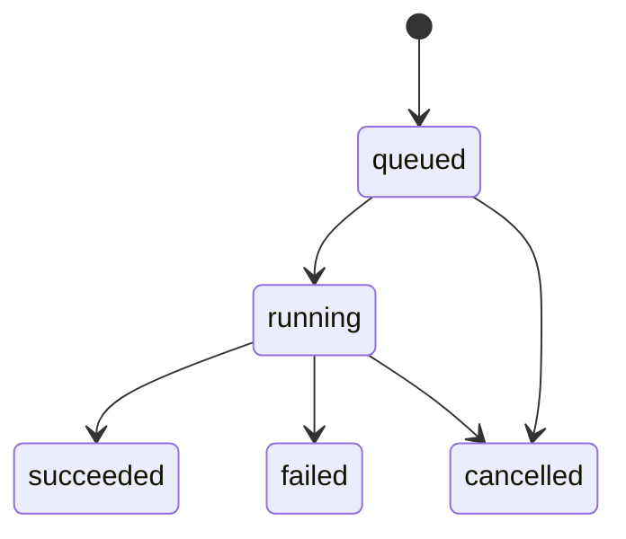

# Job-based API Design (Mac-first, cloud-ready)

This design replaces “long-running inference requests” with a **job model**. It improves:

- Stability under concurrency (backpressure, queueing, cancellation)
- Latency predictability (fast request/response for enqueueing)
- Cloud readiness (API process can be separate from GPU workers)
- Vendor model integration (remote providers become workers/providers too)

## Core concepts

- **Job**: a request to generate an artifact (image or mesh). Jobs have a lifecycle and emit events.\n+- **Artifact**: a stored output (PNG/GLB/MP4/etc) referenced by ID and a URL.\n+- **Worker**: executes jobs. May be local (in-process thread) or remote (separate GPU service).\n+
## State machine



## API surface (recommended)

### Create jobs

- `POST /api/jobs/img2img`\n+- `POST /api/jobs/triposr`

Request body should be JSON + either:

- direct `image_base64` (easy) or
- `image_path` referencing a previously uploaded file in `data/input/` (preferred for cloud)

Response:

```json
{ "job_id": "uuid", "status": "queued" }
```

### Poll job status

- `GET /api/jobs/{job_id}`

Response:

```json
{
  "job_id": "uuid",
  "type": "img2img",
  "status": "running",
  "created_at": "2026-01-14T00:00:00Z",
  "started_at": "2026-01-14T00:00:01Z",
  "ended_at": null,
  "progress": { "current": 7, "total": 20, "percent": 35.0 },
  "result": null,
  "error": null
}
```

### Stream events (SSE or WebSocket)

Recommended:

- `GET /api/jobs/{job_id}/events` (SSE)

Event types:

- `queued`
- `started`
- `progress` (structured payload, monotonic)\n+- `artifact` (when an artifact becomes available)\n+- `completed`\n+- `failed`\n+- `cancelled`\n+
This matches the frontend’s current “progress callbacks” approach but makes it durable and multi-process friendly.

### Cancel job

- `POST /api/jobs/{job_id}/cancel`

Semantics:

- If queued: removed from queue.\n+- If running: best-effort cancellation; may complete if the model runtime cannot be interrupted safely.\n+
## Artifact model

Artifacts should be separate from jobs to enable:

- retries producing multiple versions
- caching / dedupe
- long-lived browsing in UI

Suggested endpoints:

- `GET /api/artifacts/{artifact_id}` → metadata + URL

Artifact fields:

- `artifact_id`
- `kind`: `image` | `mesh` | `video` | `preview`
- `mime_type`
- `byte_size`
- `sha256` (optional)\n+- `storage`: `local_fs` | `s3` | `gcs`\n+- `url` (public or signed)\n+
## Queue and worker implementation options

### Local dev (Mac)

Keep it simple:

- API process holds an **in-memory queue**\n+- A single worker thread (or small fixed pool) executes jobs sequentially per model\n+- Use `asyncio.Queue` + `asyncio.to_thread()` or a dedicated `ThreadPoolExecutor`\n+
This is enough for “<10 users” because the real constraint is GPU time, not HTTP concurrency.

### Cloud

Split API from workers:

- **API service**: validates requests, writes job rows (DB) and enqueues job IDs\n+- **Queue**: Redis (or SQS/PubSub)\n+- **GPU worker service**: claims jobs, loads models once, executes, writes artifacts to object storage\n+
Backing store:

- Minimal: Redis + in-memory status (not durable)\n+- Better: Postgres for job state + artifacts, Redis for queueing\n+
## Backpressure policy (important for stability)

Define global limits:

- max queued jobs per user/org\n+- max running jobs per worker\n+- per-model concurrency (often 1 per GPU for SD/TripoSR unless you implement batching)\n+
When limits are exceeded:\n+- respond `429 Too Many Requests` with `Retry-After`\n+
## How this supports vendor APIs (“Nano Banana” etc.)

Vendor inference fits naturally:

- Implement a `VendorProvider` that runs inside a worker\n+- The worker calls the vendor API and emits the same job events\n+- Artifacts can be stored as:\n+  - vendor-hosted URLs (if allowed), or\n+  - downloaded and stored into your artifact store\n+
