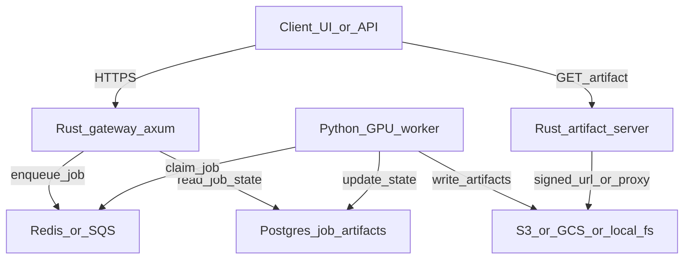

# Rust Boundary Recommendation (Stability + Latency + Performance)

You asked whether the backend should be written in Rust, with **stability + latency/perf** as primary goals.

## Executive summary

- **Do not rewrite the model inference stack in Rust first.** Your two core workloads (Diffusers SD1.5 + TripoSR) are Python/PyTorch-native; rewriting would be a multi-quarter effort and would likely regress capability.\n+- **Rust can still help a lot** as an “edge layer” that improves robustness, concurrency handling, and deployment—while keeping inference in Python workers.\n+
The highest ROI Rust roles are:\n+
1. **API gateway / edge service** (auth, rate limiting, request validation, routing, fan-out)\n+2. **Job orchestrator** (queueing, scheduling, retries, cancellation semantics)\n+3. **Artifact server** (fast, safe static serving, signed URL minting)\n+
## Recommended architecture (Rust + Python workers)

### Why this helps latency/perf

- Rust gateway can handle high concurrency with low overhead, even if workers are slow.\n+- You can implement strict **backpressure** (429 + retry-after) and avoid stampeding GPU memory.\n+- Workers can stay hot (models preloaded) and only do ML work.\n+
## Interop choice: HTTP vs gRPC

### Option A: HTTP/JSON (fastest to build)

- Rust gateway talks to Python worker via:\n+  - queue + DB only (recommended)\n+  - or direct HTTP if you keep workers addressable\n+
Pros:\n+- Simple, debuggable\n+- Works well with SSE/WebSocket at the edge\n+\n+Cons:\n+- More overhead than gRPC, but not the bottleneck versus GPU inference.\n+
### Option B: gRPC for internal worker RPC (later)

Use gRPC for:\n+- worker control plane (warmup, health, load/unload)\n+- artifact ingestion\n+\n+Pros:\n+- Strong typing, streaming\n+- Better tooling at scale\n+\n+Cons:\n+- More infra complexity\n+
## Streaming progress events

Keep **SSE/WebSocket at the Rust gateway**.\n+
Implementation approach:\n+- Worker emits progress into job state/events table (or Redis pubsub)\n+- Gateway fans out to clients\n+\n+This avoids keeping long-lived connections open to Python workers.\n+
## Security + stability wins you get “for free” with Rust at the edge

- Strict parsing and smaller attack surface\n+- Better resilience under load (bounded queues, memory-safe)\n+- Centralized auth + request logging + structured metrics\n+
## What about full Rust inference?

It can be worth it **only if you change the model runtime**:\n+
- SD: ONNX/TensorRT (NVIDIA) or another optimized runtime\n+- TripoSR: similarly, you’d need a portable inference format and kernels\n+\n+Tradeoffs:\n+- You’ll lose the ability to easily adopt new Diffusers features and community models.\n+- You’ll spend a lot of time on conversion, quantization, and kernel correctness.\n+
Given your roadmap (vendor APIs + iterative model additions), keep inference in Python initially.\n+
## Practical recommendation for your targets (Mac now, cloud later)

- **Mac local app**:\n+  - Python-only is fine; implement the job queue model and concurrency limits.\n+  - If you want extra robustness, add a small Rust artifact server to safely serve `/data/*`.\n+- **Cloud**:\n+  - Rust gateway + Python GPU workers is a strong default.\n+  - Add Postgres for job state + S3 for artifacts; scale workers horizontally.\n+
